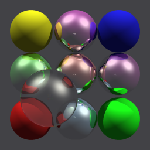
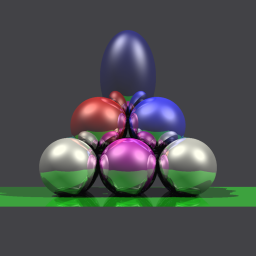
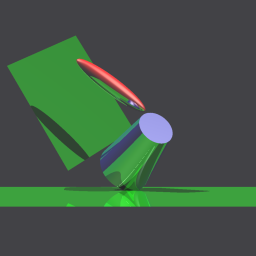
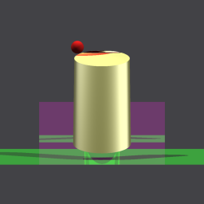

# The INMOS occam raytracer

More details about the structure and background of this program can be found in the INMOS Technical Note *72-TCH-007 Exploiting concurrency: a ray tracing example*.

- [HTML version](http://transputer.net/tn/07/tn07.html)
- [PDF version](http://transputer.net/tn/07/tn07.pdf)

### The 4 World Models

Pictures are: 256 x 256 x 24

    

### Performance

Values are in seconds.

|Workers|Type|Mod1|Mod2|Mod3|Mod4|Notes|
|--|--|--|--|--|--|--|
|16 |T805-120/16MB|6.5|7.5|2.0|1.5|Acorn CLE-215+ (XC7A200T-3 Artix-7 FPGA)|
|4  |T805-230/16MB|13.0|14.5|3.8|2.7|1/3 of a [Kria Transputer Machine](http://transputer.net/ktm) (ZU5EV Zynq UltraScale+ FPGA)|
|3  |T805-TRAMs|162|175|48|34|IMS-B012 with 1xT805-30 and 2xT805-25|
|1  |T805-66/64MB|164|176|47|33|ZTEX 2.04 (XC6SLX16-2 Spartan-6 FPGA)|

### My adjustments

- The original source code I've taken from [Ram's transputer page](http://transputer.classiccmp.org/software/graphics/occam-raytracer.tar.gz)
- I've made some rework to generate .ppm instead of .mtv
- Also removed the worker timer, because it's measurement is useless and includes the time of the user interaction.
- The strangest thing found: *VAL ticksPerSecond IS 625000 / 64 :  -- lo priority*. T414A sends regards with high and low timer at the same rate of 1.6us.
- Created an include file. To have the same VALs (215!) in 3 source files is pointless and dangerous.
- In the configuration I seperated the processors and the workers. I believe that the first transputer should also contain an worker. If your system contains an high number of processors this might be counterproductive.
- The NWP (no unused parameter warnings) and NWU (no unused name warnings) switches are not required anymore.
- Many empty lines in the output has been removed. It's still an chatty program but makes sense if your processing power is limited.
- Bigger commented code section (e.g. dither) has been also removed.
- As the framebuffer (=the main program) now runs as a whole at prio high, the PRI PAR at line 90 has been changes to PAR. If you configure the framebuffer process as the only module on an processor I would revert this.
- There is an makefile and a few different configuration files. 
- In renderPixels the output sequence must be 'done ! 42' BEFORE pixelsOut.

### Other implementations

- [James Wilson](https://github.com/machineroom/oc-ray)
- [Stefan Fennek](https://github.com/DigiFennek/TransputerApps)

